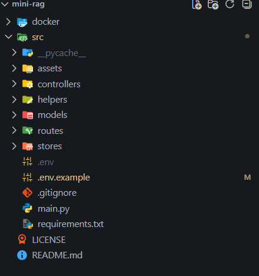
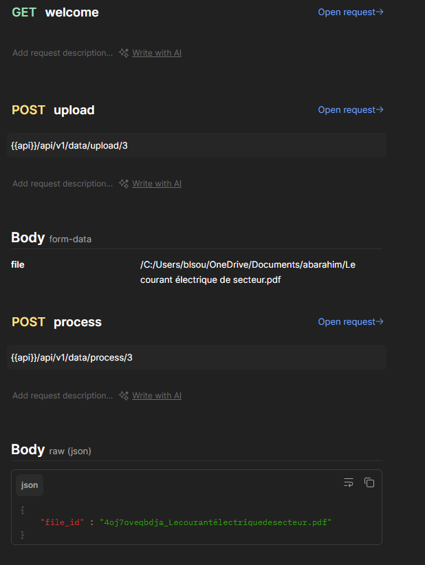
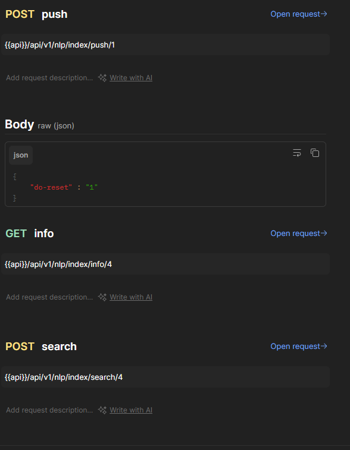
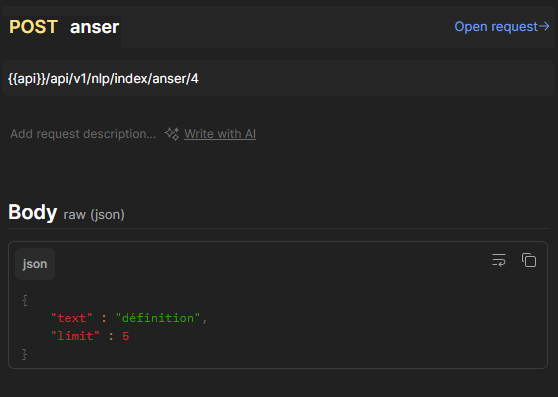

<div align="center">

# 🤖 mini-rag — Retrieval-Augmented Generation API


A minimal, production-structured **Retrieval-Augmented Generation (RAG)** backend API — built with **Python**, **FastAPI**, **MongoDB**, and **Docker**. Upload documents, build a semantic index, and query them with natural language.

**👨‍💻 Author:** Marnissi Ahmed Mustapha &nbsp;|&nbsp; **📅 Last Updated:** May 2026

[](https://github.com/AhmedMustaphaMarnissi)

</div>

---

## ⚡ TL;DR

mini-rag is a **RAG pipeline exposed as a REST API**. You upload a document (PDF, text), process and chunk it, push it into a semantic vector index, and then query the index to retrieve relevant chunks or get a direct generated answer — all through clean, versioned FastAPI endpoints.

👉 Not a chatbot wrapper — a **structured, layered RAG backend** built with separation of concerns: controllers, models, routes, helpers, and stores each live in their own layer.

---

## 💡 Key Highlights

- Full RAG pipeline over a REST API: Upload → Process → Index → Search → Answer
- Clean **layered project structure** inside `src/`: controllers, helpers, models, routes, stores
- Versioned API routes under `/api/v1/`
- Two distinct route groups: **Data routes** (file management) and **NLP/Index routes** (semantic operations)
- **MongoDB** as the document store (via Docker)
- **Docker** setup included for containerized deployment
- Environment variable configuration via `.env` (with `.env.example` provided)
- Tested with real documents including multilingual PDFs (French technical documents)
- Built following a step-by-step educational RAG architecture

---

## 📋 Table of Contents

- [Overview](#overview)
- [What is RAG?](#-what-is-rag)
- [Project Structure](#-project-structure)
- [Pipeline Flow](#-pipeline-flow)
- [API Reference](#-api-reference)
  - [Welcome](#-welcome)
  - [Data Routes — Upload & Process](#-data-routes--upload--process)
  - [NLP Index Routes — Push, Info, Search, Answer](#-nlp-index-routes--push-info-search-answer)
- [Tech Stack](#tech-stack)
- [Getting Started](#getting-started)
- [What I Learned](#-what-i-learned)

---

## Overview

**mini-rag** implements a complete Retrieval-Augmented Generation pipeline from scratch. The core idea: instead of asking an LLM to answer from memory alone, you give it a knowledge base of your own documents. The system retrieves the most semantically relevant chunks from those documents and uses them as context to generate a grounded, accurate answer.

The entire pipeline is exposed through a FastAPI REST API, organized into two route groups — one for document management (upload and processing), and one for NLP operations (indexing, retrieval, and answering). Each operation is a discrete step, making the pipeline transparent, debuggable, and easy to extend.

---

## 🧠 What is RAG?

**Retrieval-Augmented Generation (RAG)** is an AI architecture pattern that combines two components:

1. **Retrieval** — A semantic search system that finds the most relevant chunks of text from a document corpus given a user query. This is done using vector embeddings and similarity search.

2. **Generation** — A Large Language Model (LLM) that uses the retrieved chunks as context to generate a grounded, accurate answer — rather than hallucinating from training data alone.

```
User Query
    ↓
Embed the query → Search the vector index → Retrieve top-k chunks
    ↓
Feed chunks as context to the LLM
    ↓
Generated Answer (grounded in your documents)
```

RAG is the foundation of modern document Q&A systems, enterprise knowledge bases, and AI-powered support tools.

---

## 📁 Project Structure

```
mini-rag/
│
├── docker/                    # Docker configuration files
│
├── src/                       # All application source code
│   ├── __pycache__/
│   ├── assets/                # Static assets
│   ├── controllers/           # Request handlers — business logic entry points
│   ├── helpers/               # Utility functions (chunking, embedding, etc.)
│   ├── models/                # Pydantic data models and MongoDB schemas
│   ├── routes/                # FastAPI route definitions (versioned endpoints)
│   └── stores/                # Data layer — MongoDB access and vector store
│
├── .env                       # Local environment variables (not committed)
├── .env.example               # Environment variable template
├── .gitignore
├── main.py                    # FastAPI application entry point
├── requirements.txt           # Python dependencies
├── LICENSE
└── README.md
```



### Layer Responsibilities

| Layer | Folder | Responsibility |
|---|---|---|
| Routes | `src/routes/` | Define API versioned endpoints and wire to controllers |
| Controllers | `src/controllers/` | Handle request/response logic and call helpers |
| Helpers | `src/helpers/` | PDF parsing, text chunking, embedding generation |
| Models | `src/models/` | Pydantic schemas for request/response validation and MongoDB documents |
| Stores | `src/stores/` | MongoDB operations and vector index interactions |

---

## 🔄 Pipeline Flow

The full RAG pipeline is split into explicit steps — each step is a separate API call, giving full control over the process:

```
Step 1 — UPLOAD
  POST /api/v1/data/upload/{project_id}
  → Upload a PDF or text file
  → File is stored and assigned a unique file_id

Step 2 — PROCESS
  POST /api/v1/data/process/{project_id}
  → Send the file_id
  → Document is parsed, cleaned, and split into chunks

Step 3 — PUSH
  POST /api/v1/nlp/index/push/{project_id}
  → Push processed chunks into the vector index
  → Chunks are embedded and indexed for semantic search
  → "do-reset": "1" optionally wipes and rebuilds the index

Step 4 — SEARCH or ANSWER
  POST /api/v1/nlp/index/search/{project_id}   → retrieve relevant chunks
  POST /api/v1/nlp/index/anser/{project_id}    → retrieve + generate an answer
```

---

## 📡 API Reference

The full API is organized into two route groups under `/api/v1/`. All endpoints use a `{project_id}` path parameter to scope operations to a specific project or document collection.

---

### ✅ Welcome

A health check endpoint to confirm the API is running.



| Method | Endpoint | Description |
|---|---|---|
| GET | `/welcome` | Health check — confirms the API is live |

---

### 📂 Data Routes — Upload & Process

Document ingestion pipeline: upload a file, then trigger processing to extract and chunk its content.

| Method | Endpoint | Description |
|---|---|---|
| POST | `/api/v1/data/upload/{project_id}` | Upload a document file (PDF or text) for a given project |
| POST | `/api/v1/data/process/{project_id}` | Parse and chunk the uploaded document by its `file_id` |

**Upload request** — `form-data`:
```
file: /path/to/document.pdf
```
Example tested with a real French technical PDF: `Le courant électrique de secteur.pdf`

**Process request** — `raw (json)`:
```json
{
    "file_id": "4oj7oveqbdja_Lecourantélectriquedesecteur.pdf"
}
```
The `file_id` is the unique identifier returned after upload. Sending it to `/process` triggers text extraction, cleaning, and chunk splitting with configurable overlap.

---

### 🧠 NLP Index Routes — Push, Info, Search, Answer

Semantic operations: build the vector index from processed chunks, inspect it, search it, and generate answers.



| Method | Endpoint | Description |
|---|---|---|
| POST | `/api/v1/nlp/index/push/{project_id}` | Embed all processed chunks and push them into the vector index |
| GET | `/api/v1/nlp/index/info/{project_id}` | Retrieve metadata about the current vector index (chunk count, status) |
| POST | `/api/v1/nlp/index/search/{project_id}` | Semantic search — retrieve the top-k most relevant chunks for a query |
| POST | `/api/v1/nlp/index/anser/{project_id}` | Full RAG answer — retrieve relevant chunks and generate a grounded answer |

**Push request** — `raw (json)`:
```json
{
    "do-reset": "1"
}
```
Setting `"do-reset": "1"` clears the existing index before rebuilding — useful for re-indexing after adding new documents.

---



**Answer request** — `raw (json)`:
```json
{
    "text": "définition",
    "limit": 5
}
```

| Field | Type | Description |
|---|---|---|
| `text` | string | The natural language query to answer |
| `limit` | int | Number of top-k chunks to retrieve as context for the LLM |

The `/anser` endpoint runs the full RAG cycle: it embeds the query, retrieves the `limit` most semantically similar chunks from the index, passes them as context to the LLM, and returns a generated answer grounded entirely in the document content.

---

## Tech Stack

| Layer | Technology |
|---|---|
| Language | Python 3.8+ |
| API Framework | FastAPI + Uvicorn (port 5000) |
| Database | MongoDB (via Docker + Motor async driver) |
| Vector Index | Semantic vector store (configurable) |
| Embeddings | LLM embedding model (configurable via `.env`) |
| LLM | OpenAI-compatible LLM (configurable via `.env`) |
| Containerization | Docker + Docker Compose |
| Config | `.env` environment variables |
| API Testing | Postman |

---

## Getting Started

### Prerequisites

- Python 3.8 or later
- Docker & Docker Compose
- MiniConda (recommended) or a Python virtual environment
- An OpenAI API key (or compatible LLM provider)

### 1. Clone the repository

```bash
git clone https://github.com/ahmedmustaphamarnissi/mini-rag.git
cd mini-rag
```

### 2. Set up a Python environment with MiniConda

Download and install MiniConda from [here](https://docs.anaconda.com/free/miniconda/#quick-command-line-install), then:

```bash
conda create -n mini-rag python=3.8
conda activate mini-rag
```

> **(Optional)** Improve terminal readability with a cleaner prompt:
> ```bash
> export PS1="\[\033[01;32m\]\u@\h:\w\n\[\033[00m\]\$ "
> ```

### 3. Install dependencies

```bash
pip install -r requirements.txt
```

### 4. Configure application environment variables

```bash
cp .env.example .env
```

Open `.env` and set your values — at minimum:

```env
OPENAI_API_KEY=your-key-here
```

### 5. Start Docker services (MongoDB)

```bash
cd docker
cp .env.example .env
```

Update the Docker `.env` with your credentials, then:

```bash
cd docker
sudo docker compose up -d
```

### 6. Run the FastAPI server

```bash
uvicorn main:app --reload --host 0.0.0.0 --port 5000
```

The API will be available at `http://localhost:5000`
Swagger docs: `http://localhost:5000/docs`

### 7. Test with Postman

Download the Postman collection from [`/assets/mini-rag-app.postman_collection.json`](/assets/mini-rag-app.postman_collection.json) and run the full pipeline:

1. `GET /welcome` — confirm the server is up
2. `POST /api/v1/data/upload/{project_id}` — upload your PDF
3. `POST /api/v1/data/process/{project_id}` — process the file using the returned `file_id`
4. `POST /api/v1/nlp/index/push/{project_id}` — build the vector index (`"do-reset": "1"` to start fresh)
5. `GET /api/v1/nlp/index/info/{project_id}` — verify the index was built
6. `POST /api/v1/nlp/index/search/{project_id}` — test retrieval with a query
7. `POST /api/v1/nlp/index/anser/{project_id}` — get a full RAG-generated answer

---

## 🧠 What I Learned

- Understanding the full RAG pipeline end-to-end: document ingestion, chunking, embedding, vector indexing, retrieval, and LLM-augmented generation
- Designing a clean layered Python architecture separating routes, controllers, helpers, models, and stores
- Building versioned REST APIs with FastAPI and organizing them into logical route groups
- Parsing and processing real-world PDF documents (including multilingual technical content) and splitting them into semantic chunks with overlap
- Working with MongoDB as a document store using the Motor async driver
- Containerizing a Python backend with Docker and Docker Compose
- Managing environment-based configuration for LLM providers and database connections
- Using Postman to test a multi-step stateful API pipeline where each call depends on the output of the previous one

---

<div align="center">

Built with ❤️ in Bizerte, Tunisia 🇹🇳

[](https://github.com/AhmedMustaphaMarnissi)

</div>